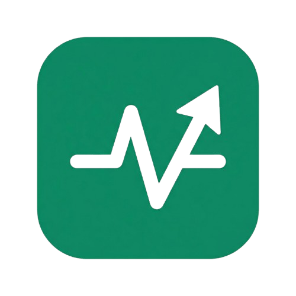

<div align="center">



# WayCare

**Plataforma de Engajamento Preventivo em Saúde**

[](https://react.dev/)
[](https://vitejs.dev/)
[](https://tailwindcss.com/)
[](https://getbootstrap.com/)
[](/)

*Challenge Care Plus — FIAP 2025/2026 · 1º ano de Engenharia de Software*

</div>

---

## Índice

- [Sobre o Projeto](#sobre-o-projeto)
- [Funcionalidades](#funcionalidades)
- [Tecnologias](#tecnologias)
- [Arquitetura IoT](#arquitetura-iot)
- [Estrutura de Pastas](#estrutura-de-pastas)
- [Pré-requisitos](#pré-requisitos)
- [Instalação e Execução](#instalação-e-execução)
- [Variáveis de Ambiente](#variáveis-de-ambiente)
- [Páginas da Aplicação](#páginas-da-aplicação)
- [API do Backend](#api-do-backend)
- [Design System](#design-system)
- [Integrantes](#integrantes)

---

## Sobre o Projeto

O **WayCare** é uma aplicação web de saúde gamificada desenvolvida em parceria com a **Care Plus**. O objetivo é transformar hábitos preventivos em uma experiência motivadora por meio de trilhas personalizadas, missões diárias, conquistas e um sistema de recompensas baseado em **Health Coins (HC)**.

O projeto integra-se com a **WayCare Dock** — um dispositivo IoT baseado em ESP32 que monitora a hidratação do usuário em tempo real e sincroniza os dados automaticamente com o aplicativo.

### Sprints de Desenvolvimento

| Sprint | Foco | Status |
|--------|------|--------|
| Sprint 1 | Prototipagem, levantamento de requisitos e HTML/CSS/Bootstrap | ✅ Entregue |
| Sprint 2 | Migração para React + Vite, Context API e componentização | ✅ Entregue |
| Sprint 3 | Integração IoT, JSON local, Tailwind CSS, novas páginas e deploy | ✅ Entregue |

---

## Funcionalidades

### Aplicação

| Funcionalidade | Descrição |
|---|---|
| 🔐 Autenticação | Login e cadastro com validação de campos e fluxo multi-step |
| 😊 Seleção de Humor | Escolha do humor do dia com badge dinâmica e trilhas recomendadas |
| 🏠 Dashboard | Visão geral de missões, trilha ativa, descobertas e banner de recompensas |
| 🛤️ Trilhas | Cards expansíveis com painel de missões, filtros por categoria e busca |
| 🎯 Detalhes da Missão | Página dedicada com descrição completa e dicas práticas |
| 🏆 Conquistas | Progresso visual de badges desbloqueados e bloqueados |
| 💡 Descobertas | Insights personalizados gerados pelos hábitos do usuário |
| 🎁 Recompensas | Catálogo com filtros e fluxo completo de resgate com confirmação |
| 👤 Perfil | Estatísticas, conquistas recentes e meta de hidratação personalizada |
| 💧 WayCare Bottle | Monitoramento IoT em tempo real com gráfico de consumo e garrafa SVG animada |
| 💰 Carteira | Saldo de Health Coins, histórico e gráfico semanal |
| 🔔 Notificações | Central de notificações com contador de não lidas |

### Técnicas

- **Integração IoT real** via hook `useWayCareDock` — polling automático a cada 3s para a WayCare Dock
- **Fallback inteligente** — quando a dock está offline, o app exibe "Demo" e continua funcionando
- **Meta de hidratação personalizada** — calculada por peso, gênero, atividade e temperatura da cidade
- **Context API** — estado global de coins, humor, garrafa e status da dock sincronizados em todo o app
- **Consumo de JSON local** — dados de trilhas, missões, recompensas e conquistas via `fetch`
- **Persistência com localStorage** — nome, email, humor, coins e histórico mantidos entre sessões
- **Tailwind CSS v4** integrado ao design system próprio
- **Responsividade completa** — Desktop, Tablet e Mobile com sidebar hamburguer

---

## Tecnologias

| Tecnologia | Versão | Finalidade |
|---|---|---|
| [React](https://react.dev/) | 18+ | Biblioteca principal de UI |
| [Vite](https://vitejs.dev/) | 5+ | Build tool e dev server |
| [React Router DOM](https://reactrouter.com/) | 6+ | Roteamento SPA |
| [Tailwind CSS](https://tailwindcss.com/) | 4+ | Classes utilitárias (`@tailwindcss/vite`) |
| [Bootstrap](https://getbootstrap.com/) | 5.3.3 | Grid e componentes |
| [Font Awesome](https://fontawesome.com/) | 6.5.0 | Ícones |
| Context API | — | Gerenciamento de estado global |
| Fetch API | — | Consumo de JSON local e backend IoT |
| localStorage | — | Persistência no navegador |

---

## Arquitetura IoT

```
┌─────────────────┐     MQTT      ┌──────────────────┐     REST     ┌──────────────────┐
│   ESP32         │ ────────────► │  Node-RED +       │ ──────────► │  waycareApi.js   │
│  (WayCare Dock) │               │  FIWARE Orion     │             │  (src/services/) │
└─────────────────┘               └──────────────────┘             └────────┬─────────┘
                                                                            │ polling 3s
                                                                   ┌────────▼─────────┐
                                                                   │ useWayCareDock()  │
                                                                   │    (hook)         │
                                                                   └────────┬─────────┘
                                                                            │
                                                                   ┌────────▼─────────┐
                                                                   │   AppContext      │
                                                                   │ Sidebar · Bottle  │
                                                                   │ Perfil · Dashboard│
                                                                   └──────────────────┘
```

O hook `useWayCareDock` faz polling automático do endpoint `/status` a cada 3 segundos. Quando o dispositivo está online, dados reais substituem os dados demo em todo o app. A URL do backend é configurada via variável de ambiente `VITE_API_URL`.

---

## Estrutura de Pastas

```
waycare-react/
├── public/
│   ├── images/
│   │   └── LogoWayCare.png
│   └── data/                          # JSONs acessíveis via fetch (simula API)
│       ├── trilhas.json
│       ├── missoes.json
│       ├── missoes-dashboard.json
│       ├── recompensas.json
│       ├── conquistas.json
│       ├── descobertas.json
│       ├── notificacoes.json
│       └── carteira.json
├── src/
│   ├── components/
│   │   ├── GarrafaAnimada.jsx          # SVG animado com nível de água dinâmico
│   │   ├── GraficoHidratacao.jsx       # Gráfico de área do consumo diário
│   │   ├── PerfilMetaHidratacao.jsx    # Setar meta de hidratação
│   │   └── Sidebar.jsx                 # Navegação com status real da dock
│   ├── context/
│   │   └── AppContext.jsx              # Estado global (HC, humor, garrafa, dock)
│   ├── data/                           # Fallback local dos JSONs (usado via import())
│   │   └── *.json
│   ├── hooks/
│   │   └── useWayCareDock.js           # Polling do status da dock a cada 3s
│   ├── pages/
│   │   ├── Login.jsx
│   │   ├── Cadastro.jsx
│   │   ├── Onboarding.jsx
│   │   ├── Dashboard.jsx
│   │   ├── SelecionarHumor.jsx
│   │   ├── Trilhas.jsx
│   │   ├── DetalhesMissao.jsx
│   │   ├── MissaoCompleta.jsx
│   │   ├── Conquistas.jsx
│   │   ├── Descobertas.jsx
│   │   ├── Recompensas.jsx
│   │   ├── ConfirmarResgate.jsx
│   │   ├── SucessoResgate.jsx
│   │   ├── Perfil.jsx
│   │   ├── Configuracoes.jsx
│   │   ├── WaycareBottle.jsx
│   │   ├── Carteira.jsx
│   │   ├── Notificacoes.jsx
│   │   └── NotFound.jsx
│   ├── services/
│   │   └── waycareApi.js               # Camada de acesso ao backend IoT
│   ├── styles/
│   │   ├── global.css                  # Design System + @import "tailwindcss"
│   │   └── *.css                       # Estilos por página
│   ├── App.jsx                         # Roteamento principal
│   └── main.jsx                        # Ponto de entrada
├── .env                                # Variáveis de ambiente (não versionado)
├── .env.example                        # Modelo das variáveis necessárias
├── index.html
├── package.json
├── vite.config.js
└── README.md
```

---

## Pré-requisitos

Antes de começar, certifique-se de ter instalado:

- **[Node.js](https://nodejs.org/)** versão **18 ou superior**
- **[npm](https://www.npmjs.com/)** versão **9 ou superior** *(já incluído com o Node.js)*

Para verificar se já estão instalados:

```bash
node --version   # deve exibir v18.x.x ou superior
npm --version    # deve exibir 9.x.x ou superior
```

---

## Instalação e Execução

### 1. Clone o repositório

```bash
git clone https://github.com/1ESPA-Yan/waycare-webdev.git
cd waycare-webdev
```

Ou, se preferir via ZIP, extraia o arquivo e acesse a pasta:

```bash
cd waycare-react
```

> ⚠️ A pasta `node_modules` **não está incluída** no repositório. Execute o passo 2 para instalá-la.

### 2. Instale as dependências

```bash
npm install
```

### 3. Execute em modo de desenvolvimento

```bash
npm run dev
```

O terminal exibirá algo como:

```
  VITE v5.x.x  ready in Xms

  ➜  Local:   http://localhost:5173/
  ➜  Network: use --host to expose
```

Acesse **[http://localhost:5173](http://localhost:5173)** no navegador.
A aplicação abrirá na página de **Login**.

Os arquivos otimizados serão gerados na pasta `dist/`. Para visualizar localmente antes do deploy:

```bash
npm run preview
```

## Variáveis de Ambiente

| Variável | Obrigatória | Descrição |
|---|---|---|
| `VITE_API_URL` | Não | URL base do backend da WayCare Dock (ex: `https://waycare-fiap.duckdns.org`) |

> **Sem a variável configurada**, o app opera em **modo demo** — a sidebar exibe "Demo" e os dados da garrafa são simulados localmente. Todas as demais funcionalidades continuam funcionando normalmente.

---

## Páginas da Aplicação

| Rota | Componente | Descrição |
|---|---|---|
| `/` | `Login` | Tela de entrada |
| `/cadastro` | `Cadastro` | Criação de conta em 3 etapas |
| `/onboarding` | `Onboarding` | Boas-vindas e aceite de termos |
| `/dashboard` | `Dashboard` | Página inicial — missões e trilha do dia |
| `/humor` | `SelecionarHumor` | Seleção do humor e recomendação de trilha |
| `/trilhas` | `Trilhas` | Trilhas de bem-estar com painel de missões |
| `/missao/:id` | `DetalhesMissao` | Detalhes, dicas e início de missão |
| `/missao/:id/completa` | `MissaoCompleta` | Tela de conclusão com HC ganhos |
| `/conquistas` | `Conquistas` | Badges desbloqueados e em progresso |
| `/descobertas` | `Descobertas` | Insights personalizados |
| `/recompensas` | `Recompensas` | Catálogo de recompensas por categoria |
| `/recompensas/:id/confirmar` | `ConfirmarResgate` | Confirmação antes do resgate |
| `/recompensas/:id/sucesso` | `SucessoResgate` | Feedback pós-resgate |
| `/perfil` | `Perfil` | Estatísticas e meta de hidratação |
| `/configuracoes` | `Configuracoes` | Preferências e gerenciamento de conta |
| `/waycare-bottle` | `WaycareBottle` | Monitoramento IoT de hidratação |
| `/carteira` | `Carteira` | Saldo e histórico de Health Coins |
| `/notificacoes` | `Notificacoes` | Central de notificações |
| `*` | `NotFound` | Página 404 personalizada |

---

## API do Backend

O arquivo `src/services/waycareApi.js` centraliza toda a comunicação com o backend da WayCare Dock. A URL base é lida de `import.meta.env.VITE_API_URL`.

| Função | Método | Endpoint | Descrição |
|---|---|---|---|
| `getStatus()` | `GET` | `/status` | Estado atual da hidratação (usado no polling de 3s) |
| `getHistory(horas)` | `GET` | `/history?horas=24` | Histórico de leituras para o gráfico |
| `postTara()` | `POST` | `/tara` | Aciona a tara no dispositivo físico |
| `getPerfil()` | `GET` | `/perfil` | Lê o perfil do usuário e a meta calculada |
| `postPerfil(dados)` | `POST` | `/perfil` | Salva o perfil e recalcula a meta de hidratação |
| `calcularMetaPreview(dados)` | `POST` | `/calcular-meta` | Prévia da meta sem salvar (usado no formulário com debounce) |

---

## Design System

O projeto utiliza um Design System próprio definido em `src/styles/global.css`, com `@import "tailwindcss"` no topo para habilitar o Tailwind CSS v4.

### Paleta de cores

| Variável CSS | Valor | Uso |
|---|---|---|
| `--color-primary` | `#1c9770` | Verde principal — botões, destaques, ativo |
| `--color-primary-dark` | `#157a59` | Hover dos elementos primários |
| `--color-primary-light` | `#e8f5f1` | Fundos suaves, badges primários |
| `--color-hc` | `#f5a623` | Dourado — Health Coins |
| `--color-bg` | `#f5f5f5` | Fundo geral da aplicação |
| `--color-surface` | `#ffffff` | Fundo dos cards |
| `--color-border` | `#e0e0e0` | Bordas e divisores |
| `--color-error` | `#e53935` | Erros e alertas críticos |
| `--color-warning` | `#f5a623` | Avisos e estados em andamento |

### Tailwind e especificidade

O Tailwind v4 é utilizado nos componentes novos via classes utilitárias. Para sobrescrever o design system existente, use o prefixo `!` antes da classe (ex: `!text-red-500`), que aplica `!important`.

### Padrão de commits

```
feat:     nova funcionalidade
fix:      correção de bug
refactor: reorganização de código sem mudança de comportamento
style:    ajustes visuais e de estilo
chore:    configuração, dependências e manutenção
docs:     atualização de documentação
```

---

## Integrantes

| Nome | RM |
|---|---|
| João Victor | RM 566640 |
| Gustavo Macedo | RM 567594 |
| Gustavo Hiruo | RM 567625 |
| Yan Lucas | RM 567046 |

---

<div align="center">

Desenvolvido com 💚 para o **Challenge Care Plus** · FIAP 2025/2026

</div>
